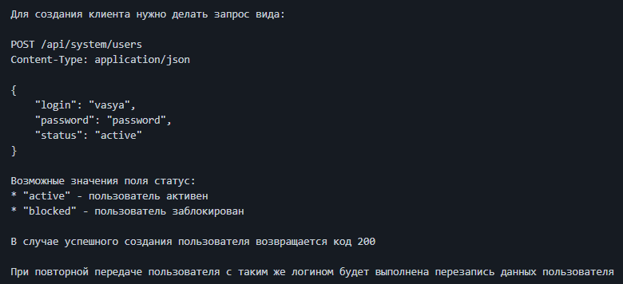

### DESCRIPTION
Предоставлен тестовый режим запуска целевого сервиса, в котором открыта программная возможность создания 
Клиентов Банка.

### [TASK](https://github.com/netology-code/aqa-homeworks/tree/master/patterns) 
Автоматизировать тестирование функции входа.

### LAUNCH
1. Запускаем приложение командой ``java -jar ./artifacts/app-ibank.jar -P:profile=test``
1. Запуск в браузере http://localhost:9999/

### TOOLS

 CI AppVeyor  
Page Object, Postman (как альтернатива)  
Java, Gradle, Lombok, REST-assured, Faker, Selenide  
Gson - возможность сериализовать (преобразовывать) Java-объекты в JSON

### CONCLUSION
Время, затраченное на 
 - автоматизированное тестирование и настройку - 8 часов.  
 - ручное тестирование и настройку - 30 мин.

Изучена реакция приложения на следующие случаи:
* наличие пользователя
* статус пользователя
* невалидный логин
* невалидный пароль
